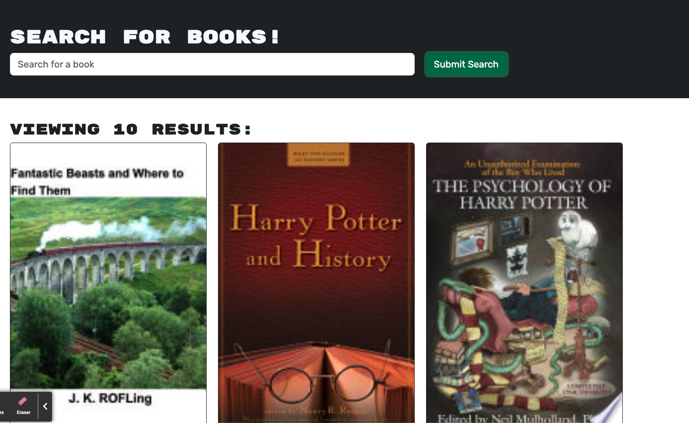

# Book Search Engine

## Description

The aim of this project was to re-factor a fully functioning Google Books API search engine which had been built with a RESTFUL API. This needed to be re-factored to use GraphQL API and Apollo Server. The starter code allowed this app to already allow users to save book searches to the back end using a Mongo DB which we have continued to use. To meet the requirements for this challenge I needed to:

## Table of Contents

- [Title](#title)
- [Description](#description)
- [Installation](#installation)
- [Usage](#usage)
- [Tests](#tests)
- [Demo](#demo)
- [Contributing](#contributing)
- [Questions](#questions)

## Installation

These dependencies are in the package.json file, run npm i to install these.
MongoDB, Heroku, Apollo Client, Apollo-Server-Express, GraphQL, BCrypt, Express.js, JSONWebToken, Mongoose, Node, Nodemon, JWT-Decode, React, React-Bootstrap, React-Dom, React-Router-Dom, React-Scripts

## Usage

You can use this application by cloning down the repo and running npm i, npm run build and npm start. You will then need to deploy this to heroku and add your MongoDB details. You will then be able to see the fully functioning application on your browser.

## Tests

You can test this application by ensuring you can login, save books, search for books. You can also head to localhost/PORT/graphql and make requests to the API.

## Demo

- [Delpoyed Site](https://faiths-book-search-engine-c5f95707a749.herokuapp.com/)

## Contributing

Faith Meades

## Questions

- [FaithsCoding](https://github.com/FaithsCoding)
- [URL](https://github.com/FaithsCoding/book-search-engine)
- You can send me any questions via email: faithscoding@outlook.com
